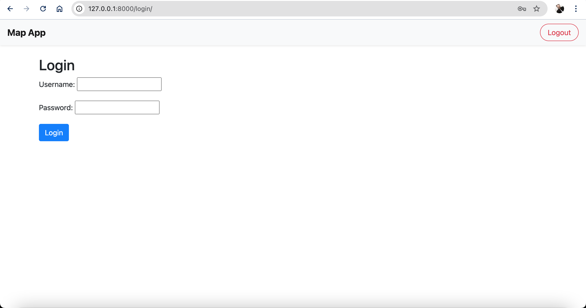
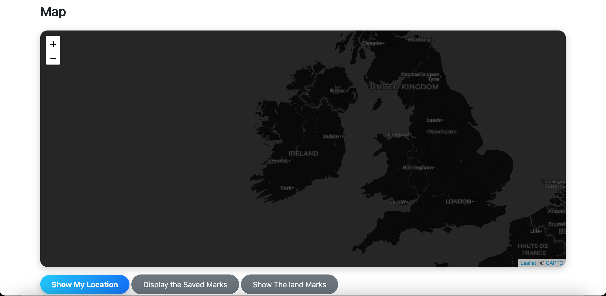
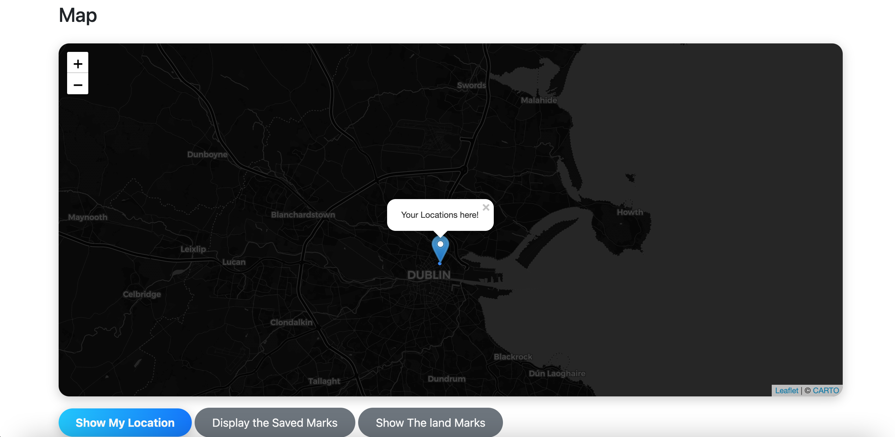
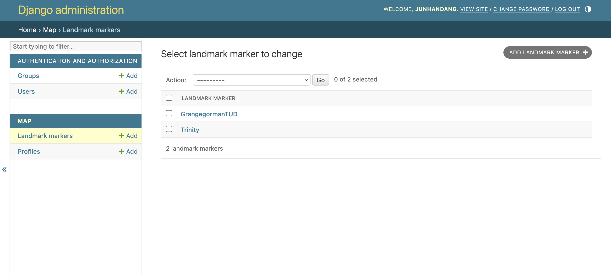
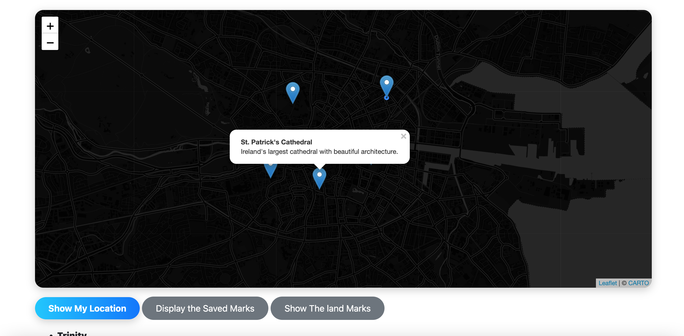
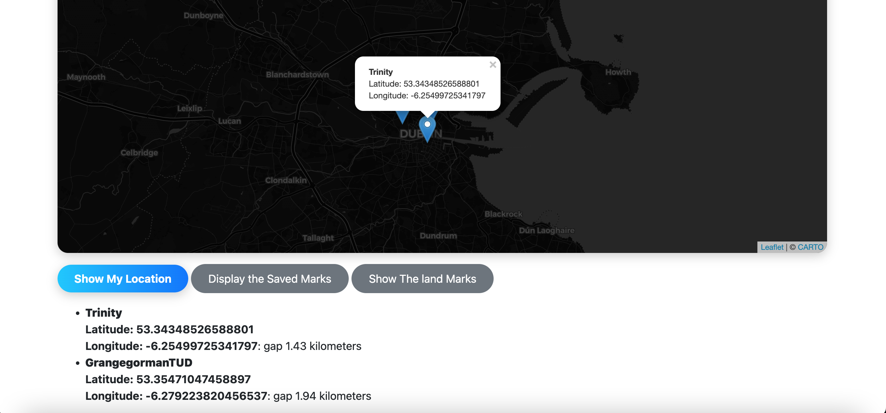

# Hi Dr Raufi Bujar My Code located in AWM_CA Branch
Student Number: D18123630
Student Name: Junhan Dang
Final version project with local and server runing with diffrent repo
https://github.com/Junhan1231/AWM_CA_Deploy

# Advanced Web Mapping Project (AWM_CA)

This project is an advanced web mapping application that integrates Django, PostGIS, Leaflet.js, and Nginx. The primary purpose of this application is to provide a location-based service with map visualization, allowing users to interact with geospatial data.

## Project Structure

- **Django**: Backend framework for handling requests and serving map data.
- **PostGIS**: PostgreSQL extension for spatial data support.
- **Leaflet.js**: Frontend JavaScript library for interactive maps.
- **Nginx**: Web server and reverse proxy for handling HTTPS and forwarding requests.
- **Certbot**: Tool for obtaining SSL certificates to secure the application.

## Features

- Location-based service using PostGIS for spatial data storage.
- Interactive map rendering with Leaflet.js.
- Secure HTTPS access using Let's Encrypt SSL certificate.
- Administrative interface through Django Admin.

## Prerequisites

- Docker & Docker Compose
- AWS account with a configured EC2 instance
- [awmcaproject.info](http://awmcaproject.info/)

## Function Screenshots

### Login

### Starting page 

### User current location

### Database for landmarks

### Show the landmarks

### Trinity Saved marks

## Data Migration 

## Docker container

